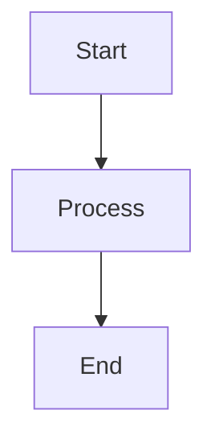
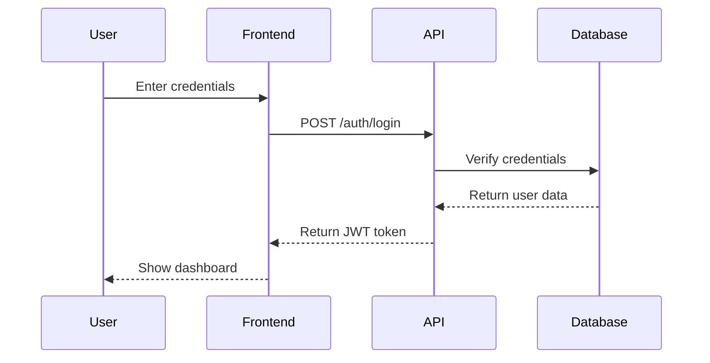

# Stop Fighting with Diagram Tools — Generate Professional Visuals from Plain Text

You need a sequence diagram for your API docs. Opening Lucidchart or draw.io means the next 45 minutes disappear into dragging boxes, nudging arrows three pixels left, and cursing the auto-layout that keeps "helping" by rearranging everything. Meanwhile, your documentation deadline isn't moving.

**Mermaid** lets you skip all of that. Write `graph TD; A-->B;` in plain text, run one command, and get a publication-ready diagram. No mouse, no layout fights, no design decisions.

## What Mermaid Actually Does

Mermaid is a text-based diagramming framework. You write simple markup describing structure and relationships. The renderer handles positioning, spacing, and styling automatically. The output looks professional by default—good enough for technical papers, client presentations, and production documentation.

It supports **flowcharts, sequence diagrams, class diagrams, Gantt charts, entity-relationship diagrams, state diagrams, and pie charts**. All from plain text. Export to PNG or SVG for any use case.

The core benefit: **you focus on content, not pixels**. Describe what you need, let the engine handle the rest.

## What You Need

- **Node.js** (v14+) — powers the CLI tool
- **npm** — installs with Node.js
- **A text editor** — VS Code, Vim, whatever you use
- **Basic markdown familiarity** — helpful but optional

Optional: **Inkscape** (free vector editor) for advanced SVG tweaking.

## Setup in Three Commands

Verify Node.js is installed:

```bash
node --version
```

If you see v14.0.0 or higher, continue. Otherwise, grab it from [nodejs.org](https://nodejs.org).

Install Mermaid CLI globally:

```bash
npm install -g @mermaid-js/mermaid-cli
```

Confirm it works:

```bash
mmdc --version
```

You should see a version number. Done.

## Your First Diagram in 60 Seconds

Create a project folder:

```bash
mkdir mermaid-diagrams
cd mermaid-diagrams
```

Create `diagram.md`:

```markdown

```

Generate a PNG:

```bash
mmdc -i diagram.md -o diagram.png
```

Open `diagram.png`. You just created a flowchart without touching a visual editor.

For vector output (scales infinitely without quality loss):

```bash
mmdc -i diagram.md -o diagram.svg
```

**Always use SVG** unless you have a specific reason to use PNG. Vector graphics scale cleanly to any size—critical for presentations and print materials.

## Real-World Example: API Authentication Flow

You need a sequence diagram showing OAuth authentication. Here's the complete workflow.

Create `auth-flow.md`:

```markdown

```

Export with transparent background:

```bash
mmdc -i auth-flow.md -o auth-flow.svg -b transparent
```

The `-b transparent` flag removes the white background—useful for slides with custom backgrounds or dark-mode documentation.

Result: a clean, professional sequence diagram ready for your API docs. Total time: under two minutes. Zero layout decisions required.

## Four Problems You'll Hit (and How to Fix Them)

**Problem 1: `mmdc: command not found`**

The CLI didn't install correctly or your PATH is broken.

Fix:

```bash
npm install -g @mermaid-js/mermaid-cli
```

Restart your terminal. If it still fails, check that npm's global bin directory is in your PATH:

```bash
npm config get prefix
```

Add that path to your shell's PATH variable.

**Problem 2: You typed `mcd` instead of `mmdc`**

Easy typo. The command is `mmdc` (Mermaid CLI). Double-check your syntax:

```bash
mmdc -i input.md -o output.svg
```

Input first, output second.

**Problem 3: SVG opens as black boxes in Inkscape**

Mermaid uses CSS properties that Inkscape can't render directly. You'll see black rectangles instead of your diagram.

Fix: convert to PDF first, then open in Inkscape:

```bash
mmdc -i diagram.md -o diagram.pdf
```

Now open `diagram.pdf` in Inkscape. Everything renders correctly and you can edit individual elements.

**Problem 4: Multiple diagrams in one file**

If your markdown file contains three Mermaid blocks, the CLI generates `diagram-1.svg`, `diagram-2.svg`, `diagram-3.svg` automatically.

Use this for batch exports. Keep all project diagrams in one source file, run one command, get all outputs.

## Customization That Actually Matters

**Switch themes:**

Mermaid ships with four themes: `default`, `forest`, `dark`, and `neutral`.

```bash
mmdc -i diagram.md -o diagram.svg -t dark
```

The `dark` theme works well for presentations. `neutral` is clean for academic papers.

**Control dimensions:**

```bash
mmdc -i diagram.md -o diagram.svg -w 1200 -h 800
```

Useful when you need diagrams to fit specific layout constraints (e.g., two-column papers, fixed-width slides).

**Use Mermaid everywhere:**

- **GitHub/GitLab markdown** — paste Mermaid code directly in `.md` files, renders automatically in PRs and READMEs
- **Notion, Obsidian, HackMD** — many editors support Mermaid natively, just paste the code block
- **LaTeX** — for academic papers, consider TikZ for programmatic figures (I covered this previously)

**Explore diagram types:**

Visit [mermaid.live](https://mermaid.live) — the official live editor. Browse examples, see syntax, experiment in real-time. Copy working examples and adapt them. Faster than reading documentation.

**Let AI write the code:**

Prompt ChatGPT or Claude: *"Create a Mermaid flowchart showing a CI/CD pipeline with build, test, and deploy stages."*

The AI outputs valid Mermaid syntax. Paste it into your markdown file, render, done. This workflow is powerful when prototyping complex diagrams or learning new diagram types.

## Why This Workflow Wins

**Version control** — diagrams live in plain text, so git tracks changes cleanly. No more binary blob commits.

**Reproducibility** — regenerate diagrams from source with one command. Update the code, re-export, consistency guaranteed.

**Speed** — no layout fights, no pixel-nudging, no tool-switching. Write, render, move on.

**Portability** — Mermaid code works anywhere: GitHub, Notion, static site generators, LaTeX workflows, CI/CD pipelines.

The default styling is good enough for production. You're not sacrificing quality for speed—you're eliminating unnecessary work.

---

**What type of diagram eats most of your time right now—flowcharts, sequence diagrams, architecture diagrams, or something else? Reply and let me know. If there's a specific Mermaid diagram type you need help with, I'll cover it in a follow-up.**

---

*What type of diagram do you spend the most time creating—and how much time would you save switching to text-based generation?*
