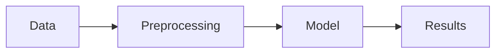
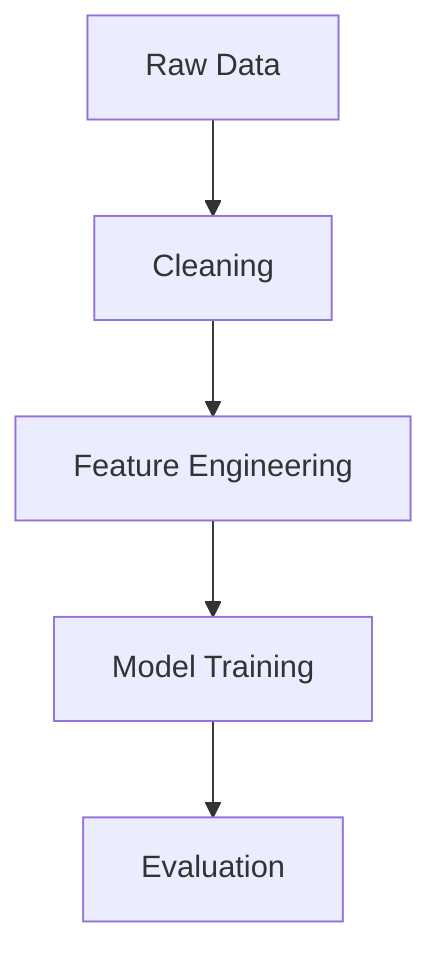

# Create Research Presentations Using Markdown — Inside Obsidian for Academics

You're preparing for your advisor meeting in two hours. Your research notes are in Obsidian, your code is in GitHub, and your equations are scattered across three LaTeX files—but now you need slides. You open PowerPoint, spend twenty minutes fighting with equation formatting, realize you can't version control a `.pptx` file, and wonder why your presentation workflow is stuck in 2005.

**There's a better way.** Write your slides in Markdown, right next to your research notes, with LaTeX equations that actually render, code blocks that syntax-highlight automatically, and the whole thing tracked in Git like any other research artifact.

---

## What Advanced Slides Does

**Advanced Slides** turns Markdown files into presentation-ready slides using Reveal.js under the hood. You write in plain text, separate slides with `---`, and preview or export to PDF—all without leaving Obsidian.

**Why this matters for researchers:**
- **Same tool, same syntax** — Write slides where you already take notes
- **Version control that works** — Track changes with Git like you do with papers and code
- **Rich content support** — LaTeX math, Mermaid diagrams, syntax-highlighted code, Excalidraw drawings
- **Multiple export formats** — PDF for conference submissions, HTML for interactive demos
- **Reuse your notes** — Embed sections from literature reviews or daily logs directly into slides

You never touch HTML. Just Markdown.

---

## Prerequisites

**Required:**
- Obsidian v1.0+
- Basic Markdown knowledge (headers, lists, links)

**Optional:**
- Obsidian Charts plugin (for embedded visualizations)
- Excalidraw plugin (for hand-drawn diagrams)
- Git (for version control)

**No coding required.**

---

## Installation

Open **Settings** (`Ctrl/Cmd + ,`) → **Community Plugins** → **Browse**

Search for `Advanced Slides` → **Install** → **Enable**

**Optional configuration:**
- Navigate to **Settings → Advanced Slides**
- Set default theme (try `white` or `serif`)
- Verify port is `3000` (change if you have conflicts)
- Note export directory: `Exports/Reveal.js/`

---

## Your First Slide Deck

Create a new note: `weekly-meeting-2024.md`

Add YAML frontmatter:

```yaml
---
theme: white
---
```

Write your first slide:

```markdown
# Project Update
Weekly progress report
```

Add a slide separator:

```markdown
---
```

Add content:

```markdown
## This Week's Results

- Completed data preprocessing
- Ran initial model training
- Identified pipeline bottleneck
```

**Open command palette** (`Ctrl/Cmd + P`) → Type `slide` → Select **"Advanced Slides: Show Slide Preview"**

A preview pane opens. Navigate with arrow keys.

---

## Core Syntax

### Horizontal vs. Vertical Slides

**Horizontal slides** (three dashes) create main sections:

```markdown
## Section 1
---
## Section 2
---
## Section 3
```

**Vertical slides** (two dashes) nest under the current section:

```markdown
## Main Topic

--

### Subtopic 1
Details here

--

### Subtopic 2
More details
```

Navigate **right** for horizontal slides, **down** for vertical. This creates a two-dimensional structure—perfect for main points with detailed sub-points.

### LaTeX Math

**Inline:**

```markdown
The loss function is $\mathcal{L} = \sum_{i=1}^{n} (y_i - \hat{y}_i)^2$
```

**Block:**

```markdown
$$
\frac{\partial \mathcal{L}}{\partial w} = 2(y - \hat{y})x
$$
```

⚠️ **No spaces** between `$` and the equation. Block equations need `$$` on separate lines.

### Code Blocks

````markdown
```python
def train_model(data):
    model = NeuralNet()
    model.fit(data)
    return model
```
````

Syntax highlighting works automatically for Python, R, JavaScript, and most languages.

### Mermaid Diagrams

````markdown

````

### Speaker Notes

```markdown
## Key Findings

- Result A
- Result B

Note:
Mention the p-value outlier from last week's discussion.
```

Everything after `Note:` is hidden from the audience but visible in presenter mode.

---

## Real-World Example: PhD Progress Report

You need to present weekly progress in 30 minutes. You have scattered notes and need slides with code, equations, and a workflow diagram.

Create `weekly-progress-week12.md`:

````markdown
---
theme: serif
---

# Weekly Progress Report
PhD Research Update — Week 12

---

## Objectives This Week

1. Implement baseline model
2. Run hyperparameter sweep
3. Analyze convergence behavior

---

## Implementation

```python
for epoch in range(num_epochs):
    loss = model.train_step(batch)
    if loss < threshold:
        break
```

Note:
Switched from Adam to SGD after epoch 50.

---

## Results

Loss converged after 120 epochs:

$$
\mathcal{L}_{\text{final}} = 0.032 \pm 0.004
$$

---

## Workflow Diagram



---

## Next Steps

- [ ] Test on validation set
- [ ] Compare with SOTA
- [ ] Write methods section
````

**Preview:** Command palette → **"Advanced Slides: Show Slide Preview"**

**Check layout:** Press `G` to toggle grid overlay. Red/orange areas indicate overflow—critical for spotting cut-off equations or diagrams.

**Overview mode:** Press `O` to see all slides in a grid layout.

**Export to PDF:** Command palette → **"Advanced Slides: Export to PDF"**

PDF saves to `Exports/Reveal.js/` in your vault. Ready for email or conference upload.

**Presenter mode:** Command palette → **"Advanced Slides: Open in Browser"**

A local server starts on port 3000. Press `S` in the browser to open speaker notes view—shows current slide, notes, timer, and next slide preview.

---

## Troubleshooting

### LaTeX Not Rendering

**Symptom:** Math shows as raw `$...$` text

**Fix:** Remove spaces between `$` and equation:

❌ `$ x^2 $`  
✅ `$x^2$`

For block equations:

```markdown
$$
E = mc^2
$$
```

### Mermaid Diagrams Don't Appear

**Symptom:** Code block shows instead of diagram

**Fix:** Verify language tag is exactly `mermaid` (lowercase):

````markdown

````

Check **Settings → Advanced Slides → Enable Mermaid support** (should be on by default).

### Content Overflows Slide

**Symptom:** Text or images cut off

**Fix:** Press `G` for grid view. Red/orange = overflow.

**Solutions:**
- Reduce font size: `<!-- .element: style="font-size: 0.8em;" -->`
- Split content across multiple slides
- Use vertical slides (`--`) for dense sections

### Port 3000 Already in Use

**Symptom:** Error when opening in browser

**Fix:** **Settings → Advanced Slides → Port** → Change to `3001` or `8080`

### Images Not Loading

**Symptom:** Broken image links

**Fix:** Use vault-relative paths:

```markdown

```

Or absolute URLs:

```markdown

```

---

## Power Features

### Callouts

```markdown
> [!warning] Caution
> This method fails with small datasets.
```

### Tables

```markdown
| Method | Accuracy | Runtime |
|--------|----------|---------|
| Ours   | 94.2%    | 12ms    |
| SOTA   | 92.1%    | 18ms    |
```

### Footnotes

```markdown
We used the standard protocol[^1].

[^1]: Smith et al., Nature 2023
```

### Fragments (Incremental Reveals)

```markdown
- First point <!-- .element: class="fragment" -->
- Second point <!-- .element: class="fragment" -->
- Third point <!-- .element: class="fragment" -->
```

Each item appears one at a time when you advance.

### Live Annotations

During presentation:
- Press `C` for chalkboard mode
- Left-click to draw
- Right-click to erase
- Press `DEL` to clear all

### Laser Pointer

Press `Q` to activate a red laser pointer (follows your mouse).

---

## What's Next

You now have slides in Markdown that live in your vault, version with Git, and export to PDF or HTML.

**Level up your workflow:**

1. **Create a template** — Add YAML frontmatter and section stubs you reuse weekly
2. **Link to daily notes** — Use `![[daily-note#section]]` to embed content from your research log
3. **Track with Git** — Version your slides alongside papers and code
4. **Try themes** — Experiment with `theme: moon`, `theme: solarized`, or `theme: league`
5. **Integrate Excalidraw** — Embed hand-drawn diagrams directly

**What's your biggest pain point with research presentations right now?** Reply and let me know—I want to know if you're fighting with equation formatting, version control, or something else entirely.

---

*How do you currently manage the gap between your research notes and presentation slides—and would a unified Markdown workflow change your setup?*
