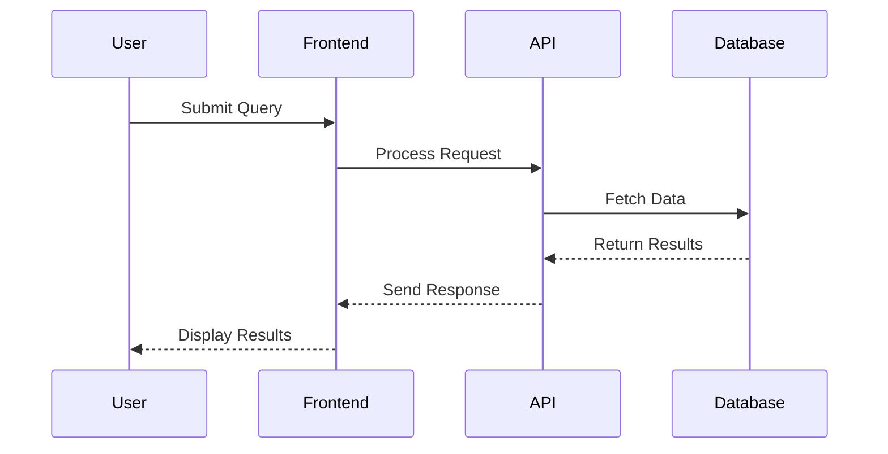
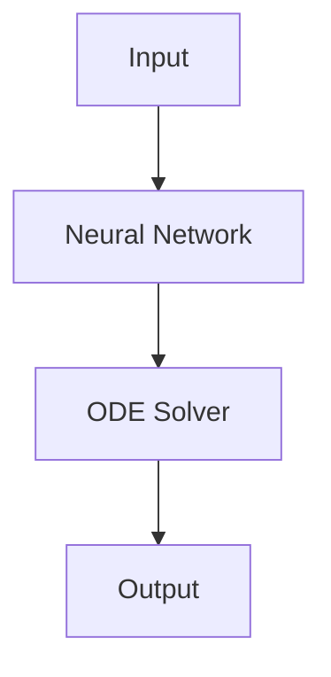

## System Architecture

## Mathematical Foundation

The Neural ODE equation: $\frac{d\mathbf{h}(t)}{dt} = f_{\theta}(\mathbf{h}(t), t)$

The diabetic retinopathy progression model:
$$
\begin{align}
\frac{d}{dt}\begin{bmatrix} 
h_{\text{thickness}}(t) \\ 
h_{\text{vascular}}(t) \\ 
h_{\text{inflammation}}(t) 
\end{bmatrix} &= \begin{bmatrix} 
f_1(\mathbf{h}(t), \theta_1) \\ 
f_2(\mathbf{h}(t), \theta_2) \\ 
f_3(\mathbf{h}(t), \theta_3) 
\end{bmatrix} \tag{3}
\end{align}
$$

where each component models:
- $h_{\text{thickness}}(t)$: retinal thickness progression
- $h_{\text{vascular}}(t)$: vascular density changes  
- $h_{\text{inflammation}}(t)$: inflammatory marker evolution

The Neural ODE equation describes continuous dynamics:
$$\frac{d\mathbf{h}(t)}{dt} = f_{\theta}(\mathbf{h}(t), t) \tag{1}$$

where:
- $\mathbf{h}(t)$ is the hidden state vector at time $t$
- $f_{\theta}$ is a neural network parameterized by $\theta$
- The tag (1) provides equation numbering

## Mathematical Formulas

Inline math: The famous equation is $E = mc^2$.

Display math:
$$
\frac{\partial f}{\partial x} = \lim_{h \to 0} \frac{f(x+h) - f(x)}{h}
$$

Complex equations:
$$
\begin{align}
\nabla \times \vec{\mathbf{B}} -\, \frac1c\, \frac{\partial\vec{\mathbf{E}}}{\partial t} & = \frac{4\pi}{c}\vec{\mathbf{j}} \\
\nabla \cdot \vec{\mathbf{E}} & = 4 \pi \rho \\
\nabla \times \vec{\mathbf{E}}\, +\, \frac1c\, \frac{\partial\vec{\mathbf{B}}}{\partial t} & = \vec{\mathbf{0}} \\
\nabla \cdot \vec{\mathbf{B}} & = 0
\end{align}
$$


sequenceDiagram
    participant User
    participant Frontend
    participant API
    participant Database
    
    User->>Frontend: Submit Query
    Frontend->>API: Process Request
    API->>Database: Fetch Data
    Database-->>API: Return Results
    API-->>Frontend: Send Response
    Frontend-->>User: Display Results



graph TD
    A[Input Data] --> B[Neural Network f_θ]
    B --> C[ODE Solver]
    C --> D[Predicted Trajectory]
    D --> E[Output]
    
    style A fill:#e1f5fe
    style B fill:#f3e5f5
    style C fill:#e8f5e8
    style D fill:#fff3e0
    style E fill:#fce4ec


## Project Overview

This research project focuses on developing Neural Ordinary Differential Equations (Neural ODEs) to model the continuous-time dynamics of diabetic retinopathy progression. By combining differential equation modeling with deep learning, we aim to predict disease progression trajectories and identify critical intervention points for better patient outcomes.

## Research Objectives

1. Develop Neural ODE architectures for modeling continuous disease progression dynamics
2. Create interpretable models that capture the underlying biological mechanisms of diabetic retinopathy
3. Apply Neural ODEs to predict individual patient progression trajectories
4. Build computationally efficient methods for real-time clinical decision support

## Mathematical Framework

Our approach models disease progression as a continuous dynamical system:

$$\frac{dh(t)}{dt} = f_\theta(h(t), t)$$

where $h(t)$ represents the hidden disease state at time $t$, and $f_\theta$ is a neural network parameterized by $\theta$.

The observed clinical measurements $y(t)$ are related to the hidden state through:

$$y(t) = g_\phi(h(t)) + \epsilon(t)$$

where $g_\phi$ is an observation function and $\epsilon(t)$ represents measurement noise.

For diabetic retinopathy progression, we incorporate multiple biomarkers:

$$\frac{d}{dt}\begin{bmatrix} h_1(t) \\ h_2(t) \\ h_3(t) \end{bmatrix} = \begin{bmatrix} f_1(h(t), \theta) \\ f_2(h(t), \theta) \\ f_3(h(t), \theta) \end{bmatrix}$$

where $h_1(t)$, $h_2(t)$, and $h_3(t)$ represent retinal thickness, vascular density, and inflammatory markers respectively.

## Current Progress

## Collaborators

## Publications

## Funding

